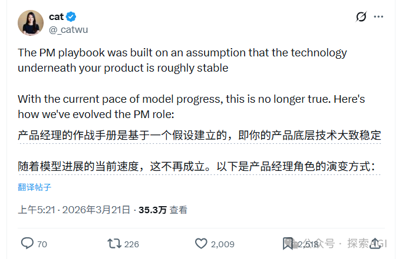
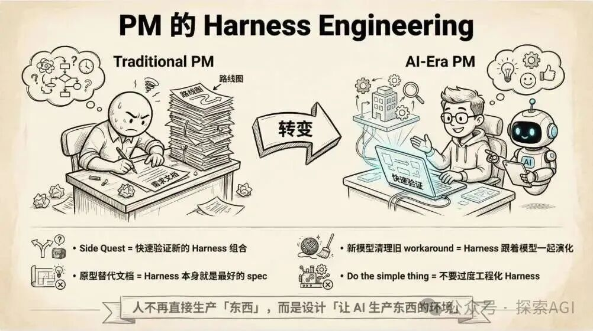
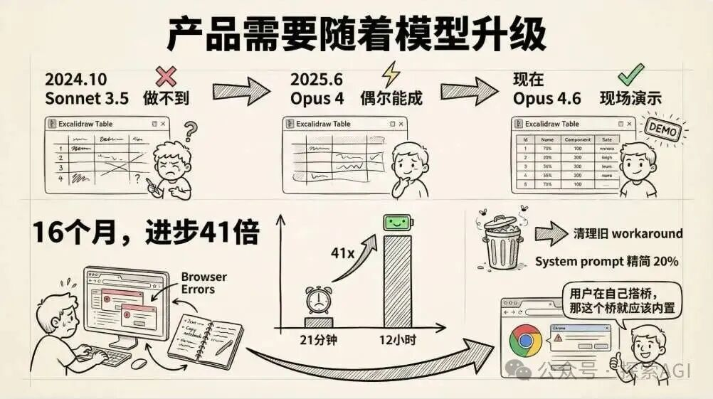
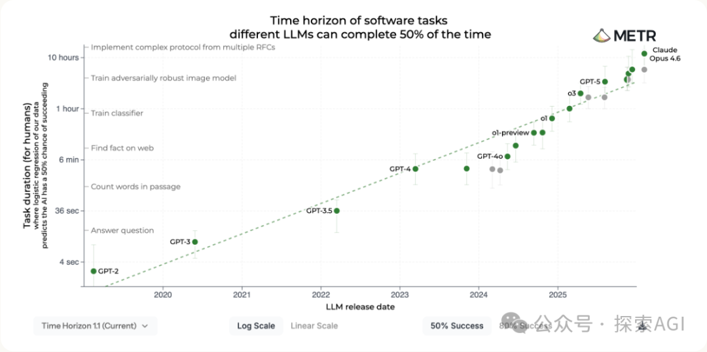
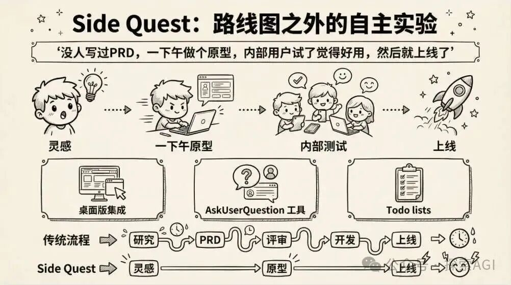
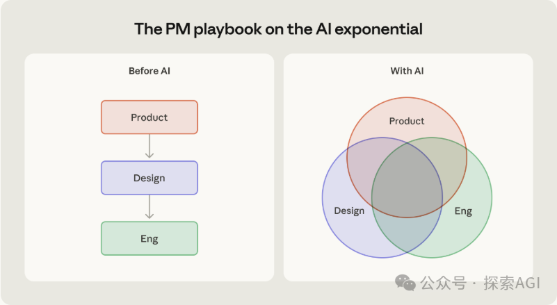
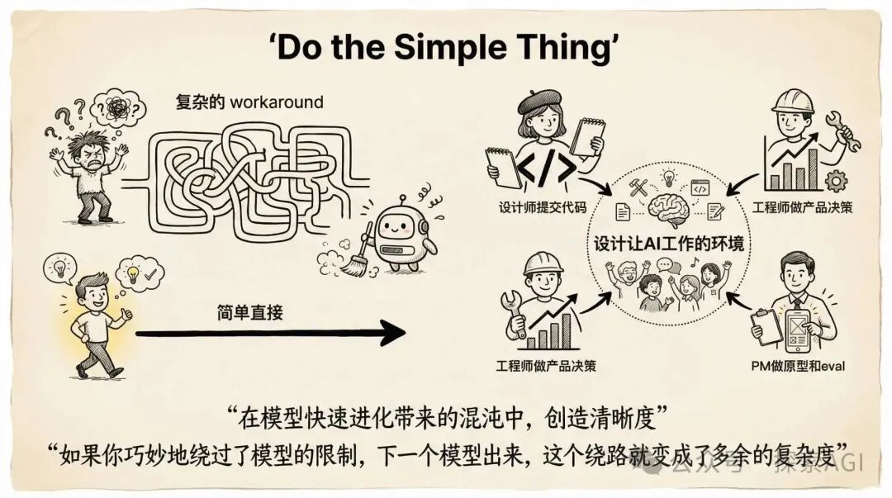

# Anthropic 产品负责人：PRD 已死，原型万岁

> 作者：猕猴桃（探索AGI）| 来源：微信公众号 | 发布日期：2026年3月27日

---

Anthropic Claude Code 产品负责人 Cat Wu ，最近聊了聊他们团队的产品经理现在到底怎么干活的。

说实话，整个看下来，这其实就是一套产品的 Harness Engineering。

整个博客，用了很多的case，来论证一件事： 模型在指数级进化，产品团队的工作方式得跟着重建。

传统 PM playbook 建立在一个假设上：项目开始时技术能做什么，结束时大体也差不多。指数级进化的模型，把这个假设掀掉了。

Cat Wu 有一个习惯：每次新模型发布，都让 Claude Code 给 Excalidraw 加一个表格工具。

2024 年 10 月，Sonnet 3.5，做不到。2025 年 6 月，Opus 4，偶尔能成，够提前录一个 demo。现在，Opus 4.6，可以在几千名开发者面前现场演示。

METR 的数据更直观：Opus 4.6 能完成需要人类约 12 小时的软件任务。16 个月前的 Sonnet 3.5 只能处理 21 分钟级别的。

16个月，进步了41倍。在这种速度下，你花三个月定的路线图，还没执行完，模型可能已经换了两代。

精心设计的 workaround，下个模型原生就支持了。

## 所以怎么办呢？

其实还是 Harness Engineering！！！

前天在 [Anthropic说：不要在等下一代模型了，立刻马上做Harness！](https://mp.weixin.qq.com/s?__biz=MzkxNjcyNTk2NA==&mid=2247491751&idx=1&sn=a46776aeac4344bc9b82fedb8006a582&scene=21#wechat_redirect) 里，我们提到：现在工程师的变化是，不写代码了，写规则、写约束、写反馈循环。

而在 Cat Wu 的这篇博客的方法论里边，PM的变化是：不写PRD了，开始做原型、写 eval、跟模型较劲。

两边都往上移了一层。人不再直接生产「东西」——无论是代码还是文档——而是设计「让 AI 生产东西的环境」。

### PM 的 Harness Engineering

- **Side Quest** = 快速验证新的 Harness 组合
- **原型替代文档** = Harness 本身就是最好的 spec
- **新模型清理旧 workaround** = Harness 跟着模型一起演化
- **Do the simple thing** = 不要过度工程化 Harness

## Side Quest

传统 PM 先研究、写 PRD、锁路线图、交给工程团队按节奏执行。Cat Wu 的团队不这么干了。

她们用一种叫 Side Quest 的机制。

> A side quest is a short self-directed experiment you run outside your official roadmap — an afternoon spent prototyping an idea, testing a capability you assumed was out of reach, or just seeing what happens when you push the model harder than you expect to.

Claude Code 里好几个最常用的功能都是SideQuest出来的。

比如桌面版集成、AskUserQuestion 工具、Todo lists。

没人写过 PRD，一下午做个原型，内部用户试了觉得好用，然后就上线了。

## 原型和 eval 替代文档

过去的PM产出的是 PRD 和需求文档。

现在是两样东西：**可运行的原型** 和 **可衡量的 eval** 。

> After you write a spec, send it to Claude Code and see if it can build it. Even a rough prototype changes the conversation.

写完 spec，直接丢给 Claude Code，看能不能做出来。哪怕是粗糙的原型，都能改变整个讨论的走向。

Noah 写了一份 plugins 的 spec，Claude Code 生成的原型直接成了上线版本的基础。

Conner 手写了一套 eval，定义什么算成功、什么算失败，成了后续迭代的锚点。

## 产品需要随着模型升级

每次新模型发布，团队会翻一遍之前「做不到」的功能清单，拿新模型再试。同时清理旧模型时代堆上去的 workaround。

她还举了个例子，使用 Todolist 的时候，早期的模型不会主动勾掉完成的任务，所以需要在 system prompt 里加提醒。

但是新模型出来后，行为变成自带的，就可以删掉提醒了。

整体上，Opus 4.6 的 system prompt 和工具描述，比上一代精简了 20%。

Chrome 集成也是这么来的。他们发现用户在用 Claude Code 写网页应用时，会手动切到浏览器测试，再手动把报错复制回来。

> If users are hacking something together, that's scaffolding you can build into the product.

用户在自己搭桥，那这个桥就应该内置。

## Do the simple thing

Anthropic 内部有个原则：做简单的事。

> If your product cleverly works around a model limitation, that workaround becomes unnecessary complexity when the next model drops.

如果你巧妙地绕过了模型的限制，下一个模型出来，这个绕路就变成了多余的复杂度。

先用最笨的方法做。模型今天不够好，别急着搭复杂的脚手架。等下一代模型，问题可能就不存在了。

## 角色在合流

Cat Wu 在博客里还提到了一件非常重要的事情：

> "Our roles are blending together: designers ship code, engineers make product decisions, product managers build prototypes and evals."

设计师在提交代码。工程师在做产品决策。PM 在做原型和 eval。

当所有人的工作都变成了「设计让 AI 工作的环境」，岗位名称就不重要了。

工程师写 AGENTS.md，PM 写 eval，设计师用 Claude Code 出原型。在抽象层面，做的是同一件事。

所以，她对新时代的 PM 定义是：

**在模型快速进化带来的混沌中，创造清晰度。推动团队想大一点。清除路上的障碍。**

Datadog 的 PM Kai Xin Tai 从另一个角度讲了类似的事：

> A PM's craft has shifted from defining certainty upfront to accelerating discovery.

PM 的手艺，从「提前定义确定性」变成了「加速发现」。

而且这种变化不只发生在产品团队。Cat Wu 说，Anthropic 内部的数据科学、财务、营销、法务、设计，都自发地开始用 Claude Code 和 Cowork 重组工作流：

> The whole organization moves at the same speed instead of waiting on handoffs.

整个组织在以同一个速度运转，而不是等待交接。

## 写在最后

前几天写 [Anthropic说：不要在等下一代模型了，立刻马上做Harness！](https://mp.weixin.qq.com/s?__biz=MzkxNjcyNTk2NA==&mid=2247491751&idx=1&sn=a46776aeac4344bc9b82fedb8006a582&scene=21#wechat_redirect) 的时候，结论是：真正稀缺的能力不在模型里面，在模型外面。而且它每隔几个月就得重写一次。

Cat Wu 这篇博客把「模型外面」的范围推得更大了。

不只是工程师在设计 Harness。PM 在做。设计师在做。整个组织都在做同一件事：设计让 AI 持续、稳定、高质量工作的环境。

角色的名字还在。但工作的本质，已经合流了。

---

### 参考资料

- [原文链接](https://mp.weixin.qq.com/s/mMfY32b5W39uR8mHnibQSg)
- 来源公众号：探索AGI（专注于大模型agent的产品落地方向）
