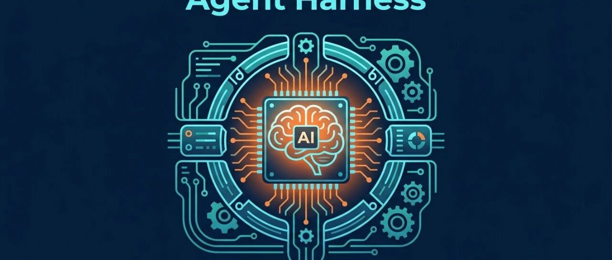

# Agent Harness：AI 从对话框走向生产力的关键架构层

> 作者：Mazy | 来源：马叔记 | 发布日期：2026年3月17日 18:58

---

同一个 Opus 4.5 模型，在 Claude Code 的 Harness 下得分 78%，换一个 Harness 只有 42%。模型没变，变的是包裹它的一切。

---

## 引言：模型不是瓶颈，Harness 才是

2026 年 1 月，红杉资本对话 LangChain 创始人 Harrison Chase。访谈中，Chase 抛出一个判断：

> "我们从 Scaffolds 时代正式迈入了 Harness 时代。"

这不是又一个行业造词。它精准描述了 AI Agent 领域正在发生的根本性转变——当模型能力趋于同质化（Claude、GPT、Gemini 在多数任务上表现接近），**决定 Agent 成败的不再是模型本身，而是包裹模型的那层软件架构**。

两个月后，这个判断被反复验证：LangChain 仅靠修改 Harness 就把 Coding Agent 的排名从第 30 名提升到第 5 名；Anthropic 发现同一个模型换不同 Harness 得分差距接近一倍；Mitchell Hashimoto 把这套方法论命名为 **Harness Engineering**，迅速成为 2026 年开发者社区最热的工程话题。

这篇文章梳理 Harness 概念的前世今生：它从哪来，解决什么问题，为什么现在才成为焦点，以及对开发者意味着什么。

---

## 一、三层架构：Model → Framework → Harness

Harrison Chase 在红杉播客中给出了一个清晰的三层定义：

| 层级 | 代表 | 特点 |
|------|------|------|
| **Model** | Claude、GPT、Gemini | 输入 Token，输出 Token。纯粹的推理引擎 |
| **Framework** | LangChain、LlamaIndex | 围绕模型的抽象层。Unopinionated——易于切换模型、添加工具，但不替你做架构决策 |
| **Harness** | Claude Code、Deep Agents | 开箱即用的 Agent 运行环境。Opinionated——内置 Planning、压缩策略、文件系统、Sub-agent 编排 |

Chase 的原话：

> "Framework 的价值在于抽象，它是无预设的。Harness 则默认内置了 Planning tool，它非常有主见（Opinionated），认为这就是做事的正确方式。"

Phil Schmid 用了一个更直觉的类比：**模型是 CPU，Harness 是操作系统**。再强的 CPU，没有好的 OS 来调度内存、管理进程、处理 I/O，也跑不好任何应用。

LangChain 在 2026 年 3 月的博客中更进一步：

> "If you're not the model, you're the harness."——如果你不是模型本身，那你就是 Harness 的一部分。

---

## 二、为什么现在？Agent 的三个拐点

Chase 把 AI Agent 的演进分为三个阶段：

### 第一阶段：原始 LLM 时代（2022-2023）

模型还是 Text-in/Text-out，没有 Chat 模式，没有 Tool Calling，没有推理能力。能做的只是简单的 Prompt 链式调用。AutoGPT 在这个阶段爆火，证明了"让 LLM 在循环中运行"的概念可行，但实际效果惨不忍睹。

Chase 的评价：

> "问题在于，当时的模型不够好，周围的 Scaffolding 和 Harness 也不够好。"

### 第二阶段：Scaffolding 时代（2023-2025）

模型实验室引入 Tool Calling，模型开始学会思考和规划。开发者需要显式地写代码搭建"脚手架"——问模型"现在该做什么？"，然后按分支走。自定义认知架构（Cognitive Architecture）成为主流。

这个时期的典型产物是 LangGraph：一个低级、可控的图状工作流框架，让开发者精细控制 Agent 的每一步决策。

### 第三阶段：Harness 时代（2025 年中至今）

拐点大约发生在 2025 年六七月。Claude Code、Deep Research、Manus 集中爆发。底层算法其实没变——还是 LLM in a loop。但围绕这个循环的 **Context Engineering** 发生了质变：压缩策略、Sub-Agent 调度、文件系统交互、结构化记忆。

Chase 的判断：

> "11、12 月发生了巨大的 Vibe Shift。大家意识到，把难题扔进去，Long Horizon Agent 真的能搞定。那一刻，模型足够好了，我们从 Scaffolds 时代正式迈入 Harness 时代。"

---

## 三、Harness 的核心组件

综合 LangChain、Anthropic、HumanLayer 等多方讨论，一个成熟的 Agent Harness 通常包含以下组件：

### 3.1 Context Engineering（上下文工程）

Anthropic 在 2025 年 9 月发布的工程博客中将其定义为：

> "在不断变化的信息宇宙中，筛选出能放进有限上下文窗口的最小高信号 Token 集合。"

这是 Harness 的核心中的核心。即使上下文窗口扩大到 100 万 Token，问题也不是"装不下"，而是 **信号被噪声淹没**——一种被称为 **Context Rot（上下文腐化）** 的现象。过了大约 60% 的窗口利用率后，更多上下文反而让 Agent 表现更差。

### 3.2 压缩与记忆

Long Horizon Agent 运行时间长，Context Window 终究有限。到某个时间点，必须对 Context 进行压缩。Chase 指出这是"Harness 的核心价值"之一。

典型策略：
- **Compaction（压缩）**：将冗长的历史消息压缩为摘要，保留关键信息
- **File System Offloading（文件系统卸载）**：把大量中间结果存入文件，只在 Context 中保留索引
- **Structured Note-taking（结构化笔记）**：如 Anthropic 的 `claude-progress.txt`，让 Agent 在每次新会话时快速理解工作状态

### 3.3 文件系统

Chase 在访谈中反复强调：

> "我是坚定的 File System Pilled。我认为某种形式上，所有 Agent 都应该能访问文件系统。"

文件系统在 Context 管理上极其有用。压缩时可以把原始消息存进文件、只留摘要；大型工具调用结果不塞给模型、让它自己去查文件。LangChain 的 Deep Agents 甚至提供了 **虚拟文件系统**，底层由 Redis 或内存支持，在不需要真实磁盘的场景下提供同样的架构优势。

### 3.4 Planning（规划）

复杂任务需要拆解。Deep Agents 内置了 `write_todos` 工具，让 Agent 自动将任务分解为离散步骤、跟踪进度、根据新信息调整计划。这不是可选项——对于 Long Horizon 任务，没有 Planning 的 Agent 会在第一个上下文窗口内就试图"一次搞定"所有事情。

Anthropic 的实验证实了这一点：即使用 Opus 4.5，不加 Harness 约束的 Agent 在构建大型应用时会"试图一次性搞定整个 App"，结果质量很差。

### 3.5 Sub-Agent（子代理）

主 Agent 可以生成专门的 Sub-Agent 来处理特定子任务，实现上下文隔离。这保持了主 Agent 的上下文干净，同时能在特定问题上深挖。

Chase 提到一个常见的失败模式：

> "Sub-agent 做了一堆工作，最后只回一句'见上文'，主模型没有收到任何有效信息。"

协调 Sub-Agent 之间信息传递的 Prompting 至关重要。

### 3.6 Middleware & Hooks（中间件与钩子）

LangChain 在改进 Deep Agents 时发现，**PreCompletionChecklistMiddleware**（完成前检查中间件）是关键技术之一——在 Agent 准备退出前拦截它，强制执行一轮验证。这类确定性的检查点是 Harness 区别于纯 Prompting 的重要特征。

---

## 四、数据说话：Harness 的性能差异有多大？

理论再漂亮，不如看数据。

### CORE Benchmark

Anthropic 的测试显示：同一个 **Opus 4.5** 模型——
- 在 Claude Code Harness 下：**78%**
- 在 Smola Harness 下：**42%**

差距接近一倍。模型完全相同，唯一的变量是 Harness。

### Terminal-Bench 2.0

Terminal-Bench 是目前最硬核的 AI Agent 终端能力基准，包含 89 个真实任务（编译代码、训练模型、搭建服务器等）。

LangChain 的实验：
- **仅修改 Harness**，Deep Agents CLI 得分从 52.8 提升到 66.5（+13.7 分）
- 排名从 **第 30 名跃升至第 5 名**

底层模型 Claude Sonnet 4.5 未做任何变化。他们的优化聚焦在三个维度：**System Prompt、Tools、Middleware**。没有换模型，没有微调，没有增加训练数据。

LangChain 的博客标题直接点明了含义：**"The Anatomy of an Agent Harness"——Opus 4.6 在 Claude Code 中的得分远低于同一模型在其他 Harness 中的得分。**

这彻底颠覆了"模型能力决定一切"的认知。

---

## 五、Harness Engineering：一门新兴学科

### Mitchell Hashimoto 的命名

2026 年 2 月，HashiCorp 联合创始人 Mitchell Hashimoto 在他的博客中分享了自己的 AI 使用历程，并为这套实践赋予了正式名称：**Harness Engineering**。

他的定义：

> "每当你发现 Agent 犯了一个错误，就花时间工程化一个解决方案，让 Agent 永远不再犯同样的错误。"

两种具体做法：
- **更好的隐式提示（AGENTS.md）**：针对 Agent 反复犯的简单错误（跑错命令、找错 API），更新指导文件。他以 Ghostty 项目为例，文件中每一行都来自一个真实的 Agent 错误行为，"几乎完全解决了所有问题"。
- **编程化工具**：编写脚本（截图、过滤测试等），配合 AGENTS.md 告知 Agent 工具的存在。

Hashimoto 的关键洞察：**Harness Engineering 是复利性的——每一次改进都适用于未来所有的 Agent 运行。**

### 术语扩散

Hashimoto 的博客发布几天后：
- **OpenAI** 发布了 "Harness engineering: leveraging Codex in an agent-first world"
- **Ethan Mollick** 用 "Models, Apps, and Harnesses" 三层框架重组了他的 AI 指南
- **Martin Fowler** 在 martinfowler.com 发表了 Harness Engineering 分析文章

从个人博客到行业标准术语，只用了几周时间。

### dex 的"外层"定义

开发者 dex 在 X 上提出了一个更精细的区分：

> "Context Engineering 是如何把上下文传给模型；Harness Engineering 是如何配置一个已有 Agent 的集成点来获得最好结果。"

对 Claude Code 来说，Harness Engineering 就是 commands、hooks、skills、agents、MCPs 等——消费者插入现有 Harness 的所有配置。

---

## 六、谁在定义 Harness 的前沿？

### Anthropic：双 Agent Harness 架构

2026 年初，Anthropic 在工程博客中披露了他们让 AI 构建大型应用的方法——一个 **双 Agent Harness**：
- **Initializer Agent**：设置项目环境——创建 Git 仓库、初始化脚本、结构化功能清单和进度日志
- **Coding Agent**：增量工作——每次会话实现一个功能、运行端到端测试、提交干净代码、更新进度

关键机制是 `claude-progress.txt`：Agent 在每次新会话时读取这个文件，快速理解"做到哪了"。灵感来自"优秀软件工程师每天都在做的事情"。

没有这层 Harness，即使是 Opus 4.5 也会试图一次性构建整个应用——然后失败。

### LangChain：Deep Agents

2026 年 3 月，LangChain 正式发布 **Deep Agents**——一个开源（MIT 许可）的 Agent Harness，基于 LangGraph 构建：
- **内置 Planning**：`write_todos` 工具自动拆解任务
- **文件系统后端**：可插拔架构（内存、本地磁盘、LangGraph Store、Modal/Daytona 沙箱）
- **Sub-Agent 生成**：主 Agent 可以 spawn 专门的子 Agent 进行上下文隔离
- **跨线程记忆**：通过 LangGraph Memory Store 实现持久化记忆

在 Terminal-Bench 2.0 上，Deep Agents 使用 Claude Sonnet 4.5 得分 42.65%，LangChain 称其与同一模型跑 Claude Code 的成绩持平。

Chase 的定位很明确：

> "LangChain 是 Agent Framework，LangGraph 是 Agent Runtime，Deep Agents 是 Agent Harness。"

### Claude Code：工程实践中的标杆

Chase 在访谈中直言：

> "说实话，目前 Harness Engineering 做得最好的都是 Coding 公司。Claude Code 之所以如此火爆，很大一部分原因在于它的 Harness 设计。"

Claude Code 的 Harness 设计包括：
- **CLAUDE.md / rules 系统**：项目级指令注入，每次会话加载
- **Hooks 机制**：PreToolUse / PostToolUse 拦截，注入确定性检查
- **Skills 系统**：可复用的任务模板
- **Sub-Agent 架构**：主 Agent 可以 spawn 探索型、执行型子 Agent
- **Compaction**：自动压缩过长的上下文历史

---

## 七、Coding Agent 是通用 Agent 的终局形态吗？

红杉播客中最有趣的讨论之一：**Pat Grady 问**："Coding Agents 到底是一个子类别，还是说所有 Agent 本质上都应该是 Coding Agents？"

**Chase 的回答**：

> "这是个大问题。我深信，构建 Long Horizon Agent 必须给它文件系统权限。"

> "所有 Agent 是否最终都是 Coding Agent，也是我们目前思考最多的问题之一。"

逻辑链条是：
1. 所有 Long Horizon Agent 需要文件系统来管理 Context
2. 文件系统天然适合代码操作
3. 代码是最精确的"指挥计算机干活"的方式
4. 因此，即使非编程任务，"写代码"本身可能就是最好的通用手段

这暗示了一个深远的未来：**Agent 的 Harness 最终可能收敛到一个以代码执行为核心的通用架构**，而非为每个垂直场景定制不同的工具链。

---

## 八、Trace 取代代码成为新的 Source of Truth

Chase 在访谈中提出了另一个重要观点：

> "软件的 Source of Truth 是代码；Agent 的 Source of Truth 是代码 + Tracing。"

传统软件中，你看代码就能推断系统行为。但 Agent 引入了非确定性黑盒——你不能只看代码就知道 Agent 在第 14 步的 Context 是什么，因为前 13 步可能拉取了任意东西。

这让 **Trace（执行轨迹）** 成为 Agent 开发的核心产物：
- 出问题时，团队不是说"看 GitHub 代码"，而是说"看 Trace"
- 开源社区反馈 Deep Agents 跑偏时，LangChain 要的是 LangSmith Trace 而非代码
- Testing 从静态断言转向 Online Testing——行为只有在遇到真实输入时才会涌现
- LLM-as-a-Judge 基于 Trace 做评分，成为 Eval 的核心模式

Chase 还指出，Agent 自我修复的本质就是"反思自己的 Trace"：Coding Agent 遇到 Error 随即纠正，Memory 的核心是反思 Trace 然后更新状态。**Evals、自动纠错、Memory——本质上是同一件事。**

---

## 九、Harness 的未来：模型会吞噬 Harness 吗？

一个自然的问题：随着模型越来越强，Harness 会不会变得不重要？

LangChain 在最新博客中的回答是审慎乐观的：

> "随着模型变得更强，今天 Harness 中的一些功能会被模型原生吸收——模型会更擅长 Planning、Self-verification 和 Long Horizon Coherence。但就像 Prompt Engineering 至今仍有价值一样，Harness Engineering 可能会长期存在。"

Chase 也提到，Anthropic 正在尝试让模型自主决定何时压缩上下文，"虽然还没普及，但这可能是方向"。

但至少在 2026 年，数据清楚地表明：**Harness 的投资回报率远高于等待下一代模型。** LangChain 用 Harness 优化获得的 13.7 分提升，可能比等一个新模型版本来得更快、更可控。

---

## 十、对开发者的启示

### 如果你在用 AI Coding Agent

你已经在一个 Harness 中了。你的 CLAUDE.md、rules 文件、hooks 配置、MCP 工具链——这些就是你的 Harness Engineering。每次你因为 Agent 犯错而更新一条规则，你就在做 Hashimoto 说的那件事：**让 Agent 永远不再犯同样的错误。**

### 如果你在构建 Agent 产品

模型选择很重要，但 Harness 设计可能更重要。Terminal-Bench 的数据证明，同一模型在不同 Harness 下的表现差异可以超过两代模型的升级幅度。投资 Harness 工程，而不是追逐最新模型。

### 如果你在做技术决策

Harness 是新的护城河。Chase 的原话：

> "一个经过长时间磨合、内化了特定任务模式与背景记忆的 Agent，将形成极高的 Moat。"

数据、Memory、领域 Instructions——这些在 Harness 中积累的资产，是新竞争者无法通过换一个更好的模型就追平的。

---

## 结语：缰绳比马更重要

>"Harness"这个词的本义是马具——用来驾驭、引导和控制马匹力量的装备。用它来命名包裹 AI 模型的架构层，精准得令人赞叹。

2025 年，我们证明了 AI Agent 能工作。 2026 年，我们学会了如何让它们可靠地工作。

这个转变的核心不是更强的模型，而是更好的 Harness。当行业还在辩论哪个模型更聪明时，真正的工程价值正在 Harness 层面安静地积累——就像 Mitchell Hashimoto 说的，每一次改进都是复利。

**模型是引擎，Harness 是整辆车。最强的引擎，没有方向盘和刹车，哪儿也去不了。**

---

### 参考资料：
- Sequoia Capital, "Context Engineering Our Way to Long-Horizon Agents" (Harrison Chase 访谈), 2026.01
- LangChain Blog, "The Anatomy of an Agent Harness", 2026.03
- LangChain Blog, "Agent Frameworks, Runtimes, and Harnesses — oh my!", 2026
- LangChain Blog, "Improving Deep Agents with Harness Engineering", 2026
- Anthropic Engineering, "Effective Harnesses for Long-Running Agents", 2026
- Anthropic Engineering, "Effective Context Engineering for AI Agents", 2025.09
- Mitchell Hashimoto, "My AI Adoption Journey", 2026.02
- Martin Fowler, "Harness Engineering", martinfowler.com, 2026
- Terminal-Bench 2.0, tbench.ai

---

*作者：Mazy | 来源：马叔记*
