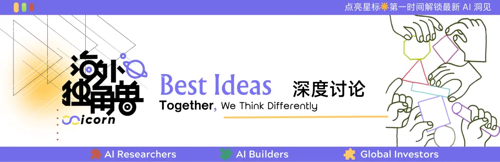
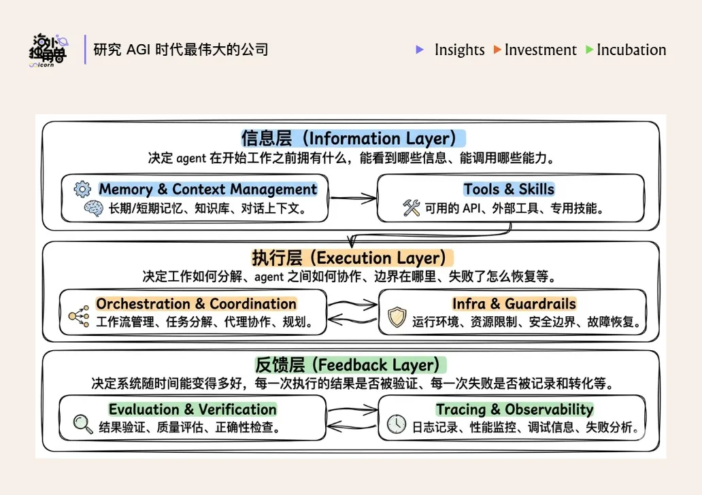
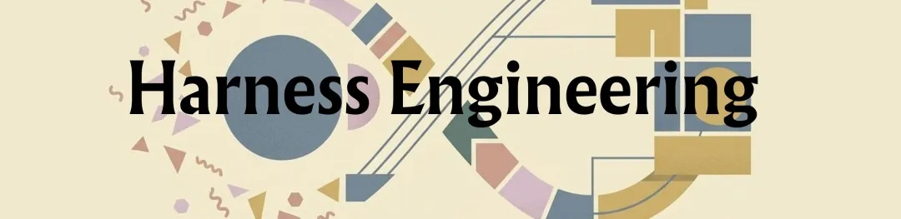

# Harness is the New Dataset：模型智能提升的下一个关键方向

> 作者：Celia、Siqi | 来源：海外独角兽 | 发布日期：2026年3月26日 20:06

---

## 为什么 Harness Engineering 开始变得重要？

"Harness"一词来自马术，本意是马具的意思，放在这里非常贴切：模型就像一匹野马，同样是一股很强但不稳定的力量。人类用马具来限定马匹的行为、掌控前进方向，而 harness 就是人类驾驭模型能力的一套外围系统。

从时间线看，AI 工程方法已经经历了三次演进：

- **Prompt engineering（2022-2024）**：关注如何表达需求，重点是打磨单次对话里的指令，研究怎么提问（e.g 添加身份、场景、目的等细节）、给出示例，从而让模型理解任务，更稳定地给出想要的结果；

- **Context engineering（2025）**：关注怎么提供恰到好处的信息。随着任务变复杂，AI 需要在有限的 context window 下了解所有的背景资料。所以，如何获取、压缩和组织上下文，成了新的工程实践重点；

- **Harness engineering（2026）**：关注如何"构建系统"，这里的"系统"可以简单理解为模型周围让它真正有用的所有部分：运行环境、工具调用、记忆系统、评估与回滚机制等等，相当于一个完整的运行环境 + 管控系统，能让 Agent 可靠、安全地完成任务。

如果要下一个定义的话，**Agent = LLM+harness**，如果说模型决定了要做什么，Harness 决定了模型能看到什么、能用什么工具，以及失败时该怎么办。

这几层演进背后的共同逻辑是：**一旦模型能力过线，瓶颈就会开始外移。**

而这一次外移的一个标志性事件，是 2025 年 11 月 Claude Opus 4.5 的发布。它意味着模型的 agentic 能力到了一个 tipping point，以至于 "用好模型的能力"，开始比 "提高模型的能力"，更加重要。也就是说，**智力本身不再是瓶颈，瓶颈转移到了系统层。**

---

## Harness 的 6 个关键组件

关于 harness 的组件目前在工程实践中还没有绝对共识，但综合目前看到的不同实践，我们认为它大致包括了以下 6 个部分：

1. **Memory & Context management (记忆与上下文管理)**：这一层解决的是"在当前时刻，Agent 应该看到什么信息"。常见做法包括上下文裁剪、压缩、按需检索，以及外部状态存储等。

2. **Tools & skills (工具与技能)**：负责扩展 Agent 的行动能力。工具提供可调用的外部能力，skills 提供可复用的任务方法。

3. **Orchestration & Coordination (编排与协调）**：也就是编排整套任务流程，协调每个 agent 的分工，决定何时规划、何时执行、何时交接，让复杂任务能被拆开、推进并收敛。

4. **Infra & Guardrails (基础设施与保障)**：负责提供运行环境和边界条件，包括沙箱、权限控制、失败恢复和安全护栏等，确保 Agent 能在真实环境中安全、稳定地运行。

5. **Evaluation & Verification (评估与验证）**：对于很多复杂任务来说，决定最终成效的往往不是第一次生成，而是有没有验证闭环。所以很多 harness 内置一套测试、检查和反馈机制，让 Agent 能自行验证自己的工作，并在发现问题后及时修正。

6. **Tracing & Observability (追踪与观测）**：负责还原 Agent 的行为过程，让整个黑箱变得尽量透明可见，例如提供执行轨迹、日志、监控和成本分析等能力。只有当这些过程是可见的，系统才是可调试、可优化、可管理的。

从完成一项真实任务的视角看，这 6 个组件其实对应着一条很清晰的链路：先准备信息，再推动执行，最后复盘结果。所以顺着这条逻辑，它们又可以进一步归成 3 层：**信息层、执行层、反馈层**。

### OpenClaw 的案例

OpenClaw 的爆火很大程度上就是 harness engineering 的一次胜利：它并不依赖模型能力，而是完全靠 harness 的设计创造出了 aha moment。OpenClaw 的核心亮点就是几个工程组件：

- **Gateway** 负责破壁，它把 WhatsApp、Discord 等社交软件统一对接给了模型，让小龙虾能像朋友一样出没在任意窗口。
- **内置 Skills 库**提供了一个趁手的百宝箱，给了它丰富的能力集合。
- **记忆机制**让它能持久地积累经验、不断进化。
- **Heartbeat** 补齐了 AI 的"主观能动性"，让它能定时、自发地醒来干活。
- **Soul.md 等身份文件**则是画龙点睛，给这些冷冰冰的代码注入了一个鲜活的人格。

每个组件单看都不复杂，但当这些微小的创新被巧妙地糅合在一起时，跨平台的存在感、主动发起对话的意愿、持续进化的记忆——这些模型本身没有的生命力就出现了。

---

## Harness 的设计原则

这里我们尝试着总结一些 Harness engineering 的核心原则。

### 信息层：帮 Agent 任务做资源准备

信息层解决的问题听起来很简单：给 agent 提供它需要的信息。但在实践中，这却是最容易犯错的地方，且错误原因往往不是给得太少，而是给得太多。因为模型存在 **context decay（上下文衰减）**的问题，随着上下文不断变长，模型并不是线性地"知道得更多"，而是更容易被无关噪音分散注意力，导致对关键信息点的利用效率下降。

因此，信息层设计的核心原则是：**精准，比求全更重要**。落实到工程上，通常会对应到下面几种路径：

**Trick 1：渐进式披露**

简单来说，就是把信息做成"分层加载"的系统，让模型在不同阶段只接触当下需要的那一层，而不是一次性把所有信息都塞给 AI。

比如，OpenAI 就曾试着用一个巨大的 AGENTS.md 把所有规则写全，但后来发现并不可行。Context 资源是极其稀缺的，一个巨大的指导文件会占据 AI 的脑容量，让它忽视真正重要的信息。

所以现在业内的最佳实践是通过文件系统来做分层披露，以 Claude Code 为例，它把核心信息做了三层分级：

- **Level 1 CLAUDE.md**：这一层只放最关键、最常用的元规则。它更像一个总入口，用来告诉模型：这个项目最基本的情况是什么，应该遵循哪些原则，不同类型的任务大概该去哪里找资料。
- **Level 2 SKILL.md**：这一层更像按需调用的小型能力包。只有在特定任务出现时，模型才会去加载对应的 skill，学习这项任务的做法。
- **Level 3**：reference、supporting files、脚本等，到这一层，模型接触的就不再是抽象原则，而是完成当前任务真正需要的细节。

本质上，渐进式披露就是控制信息的出场顺序，让模型的注意力始终集中在当前最关键的 1% 信息上。

**Trick 2：Tools 越少而精越好**

这一点其实相当反直觉：随着模型能力的提升，它对外部工具的依赖应当是递减的，而不是越加越多。

Agent 的强大不在于工具箱里有多少把扳手，而在于它是否拥有几把完美的"万能扳手"，以及如何高效地组合它们。与之相对的，**过于复杂的工具是模型幻觉的温床**。一个常见失败模式就是工具集越加越多，导致 agent 陷入决策瘫痪。

Claude Code 目前有大约 20 个工具，即使如此，他们团队也一直在审视是否真的需要所有这些工具，并且在非常谨慎地增加新工具。

Vercel 团队他们最初给 agent 配备了涵盖搜索、代码、文件、API 的完整工具库，结果表现很差；精简到只保留核心工具之后，速度和可靠性都显著提升。

**Trick 3：找到 Context window 利用率的"甜蜜区间"**

很多独立的工程实践都得出了一个相同的发现：当上下文利用率超过一个区间之后，性能就会开始下降。也就是说，给 agent 塞太多历史记忆和背景信息，不会让它更强，只会让它更糊涂。

具体的 sweet spot 根据模型、context window、任务类型的不同会有差异。表现最好的模型 (Opus 4.6 系列)，长上下文下还能维持七成的检索命中率，表现没那么稳的模型 (GPT-5.4、Gemini 3.1 Pro)，命中率会直接掉到三成。

至于为什么有效的 context window 通常没有大家想象中那么长？一个核心原因是 **Attention 的"稀疏性"**。随着 context 变长，模型的注意力会被摊薄到更多位置上。它虽然看见了更多 token，但未必还能稳定地把注意力放在最关键的那几个点上。

所以很多顶级工程师会频繁进行上下文压缩，把 context window 利用率控制在 60% 以下。

**Trick 4：利用 subagent 做 context 隔离**

当主 agent 的 context 开始变重时，把子任务分配给独立的 subagent 也是一个可行的方法。

每个 subagent 都在更小、更干净的 context 里完成自己的任务，少受无关信息干扰。等它们各自产出结果后，再回到主 agent 统一汇总和编排。

Claude Code 负责人 Boris Cherny 把这套方法叫做 **context firewall**。当遇到复杂任务时，他会直接让主 agent "use subagents"，把看日志、查代码、搜文档这些事情并行拆开，主线程自己只做两件事：调度，以及收口。

### 执行层：给 Agent 一套执行规划

如果说信息层关心的是"给 agent 什么信息"，那么执行层关心的就是"让 agent 怎么做事"。这一层最常见的一个问题，是任务结构本身设计得不对。

**Trick 5：把研究、计划、执行、验证分开**

我们在学习 top AI labs 的实践经验时，会发现一个很普遍的做法，他们会把一条任务链拆开，分成四步：**research → plan → execute → verify**，每个阶段是单独的 session，有单独的 context，而不是期待它一气呵成。

这背后同样是因为，Agent 脑容量有限，把四个阶段压进同一个 context，本身会造成一些不必要的 context 污染。所以用尽量用更多算力，完成更简明清晰的任务。

举个例子，假设我们要给产品增加一个身份验证系统，最好不要直接下达一个指令："给我做一个身份验证系统。"更好的做法是：

1. 先开一个 research session，专门研究各种可能的实现方案
2. 确定最终采用的行动方案
3. 开一个全新的 session，专门负责执行这个具体方案

Boris Cherny 的 CLAUDE.md 里就有一条明确的规则：**"Enter plan mode for ANY non-trivial task (3+ steps or architectural decisions). If something goes sideways, STOP and re-plan immediately — don't keep pushing."**

他在 26 年 1 月还又做了一层强化：用户接受计划之后，Claude Code 会自动清空 context，让执行阶段从一个干净的起点开始。

**Trick 6：人最该介入的地方，不是事后审核，而是事前规划**

绝大多数人类用户只喜欢验收结果，而不重视前期的规划设计，但实际上，人恰恰应该把精力从事后的 code review，尽量前移到 research 和 plan 这两个杠杆更高的环节。因为一行糟糕的代码，影响的可能只是一行；一行糟糕的计划，往往会长出几百行糟糕的代码。

### 反馈层：Agent 的复利飞轮

前两层决定了 agent 能做什么，反馈层决定的是系统随时间能变得多好。这是三层里最容易被忽视、也最能产生复利效应的一层。

反馈层的核心逻辑，其实就是 harness engineering 这个概念最原始的定义。Mitchell Hashimoto 在自己的 blog 中是这么写的：

> "Anytime you find an agent makes a mistake, you take the time to engineer a solution such that the agent never makes that mistake again."

这背后是一种工程纪律：每一次失败都不是终点，而是一次让系统永久变好的机会。

**Trick 7：构建反馈闭环**

在 Harness Engineering 中，最能产生复利效应的投入，就是为 Agent 构建一套自动化的反馈与校准机制。

Boris Cherny 分享过一个数据：**只要给 Claude 提供有效的验证手段，其最终产出的质量通常能提升 2-3 倍。** 他的做法包括：

- 任务完成后，提醒另一个 agent 验证结果，或者开启 stop hook 自发校验
- 用 ralph-wiggum 插件把整个流程改成"自动迭代模式"，让 Claude 不断做、不断验、不过就继续，直到满足完成条件
- 让 Claude 自己打开浏览器、测试 UI、反复迭代直到 UX 过关

Karpathy 最近提出的 **autoresearch** 的思路同样很有启发。Autoresearch 的重点不是让 AI 一次性想出最好的答案，而是让 AI 进入一个可控闭环：自主提出 idea → 做实验 → 观察实验结果 → 保留有效策略、丢掉无效分支 → 反思后继续提出不一样的改进策略 → 如此反复循环。

---

## 模型 vs harness，究竟是怎样一个关系？

关于 harness，所有人都在好奇的一个问题是：**模型会吃掉脚手架吗？** harness 当下创造的价值多大程度上会被模型厂自己做掉？

这个问题很难在今天直接给出一个明确答案，因为模型和 agent 实践的变化相当迅速。但可以确定的是，模型和 harness 的耦合程度是比多数人想象得要深的。

### 训练即部署

Agent 能力的上限，越来越由环境质量决定，而不只是模型本身，所以在 agentic RL 的训练逻辑里，模型和 harness 从一开始就不是分开设计的。

普通 chatbot 的 RLHF 是单轮的，奖励信号密集，反馈直接。Agentic RL 则非常不同，它涉及到：

- 多轮、长链路、带工具调用 (且一次 rollout 可能调用上百次工具)
- 动作空间极大
- 奖励信号非常稀疏，复杂任务可能 1000 次尝试才成功一次
- 很依赖真实环境中的反馈，比如测试有没有通过、代码跑没跑起来、lint 报没报错

这也意味着，训练效果在很大程度上取决于**"训练场设计得好不好，像不像真实世界"**。模型在训练阶段看到什么，往往就是它上线之后真正要面对什么。

比如，Cursor 在训练 Composer 1.5 时，用的几乎就是一套面向真实用户服务的 coding 环境。它会并发跑数十万个沙盒，让模型在里面反复试：先搜什么，读哪些文件，改多少代码，什么时候该停下来做验证。

在这个过程中，他们发现模型自发涌现了很多能力：

- 它开始学会在复杂代码库里做更深入的搜索
- 会顺手修掉 linter 错误
- 会自己补单元测试，再执行验证
- 也会从一开始动不动大改一片，慢慢转向先多读、少乱改

Windsurf 在训练 SWE-1.5 时，表达得更直接：

> "We believe that the quality of the coding environments in RL tasks is the most important factor for downstream model performance."
> (我们认为，在 RL 过程中，coding 环境本身的质量，对模型最终表现的影响是最大的。)

> "Our vision is to co-optimize models and harness: we repeatedly dogfooded the model, noticed issues with the harness, made adjustments to tools and prompts, and then re-trained the model on the updated harness."
> (我们的思路是把模型和 harness 当成一个整体来共同优化)

### Harness 的很多能力，在快速被模型吸收

现在模型公司都在把"模型 + harness"当成一个整体来优化。很多原本属于 harness 的能力，已经被模型逐渐内生化，比如 tool search、programmatic tool use、compilation / summarization、多步工具调用策略等。

如今的很多 harness 能力，比如 planning、self-verification，也都在公开采访里被透露过，可能会成为未来后训练的候选方向。

Claude Code 负责人 Boris Cherny 也说过，Claude Code 的 harness 在不断被重写，里面每行代码的保质期可能也就 2 个月。

### Harness 即数据

Deepmind 的 Staff Engineer Philipp Schmid 有一个金句：

> "The Harness is the Dataset. Competitive advantage is now the trajectories your harness captures."
> (Harness 本身就是数据集。现在真正的竞争优势，在于你的 harness 能捕获到怎样的执行轨迹)

现在真正有价值的数据，不再只是静态语料，还包括了 agent 在具体业务流程中跑出来的执行轨迹：它看到了什么信息，使用了什么工具，做了什么决策，哪一步容易出错，什么反馈会让它变得更好。

在这种情况下，**harness 不再只是模型外面的脚手架，而是模型能力生成的土壤，土壤的质量，会一定程度上决定和反哺智能的生长。**

---

## 创业公司的机会

随着 harness 的重要性逐渐提升，我们相信这个领域也会有一些创业公司的机会。

### 信息层

今天企业应用 AI 的最大瓶颈之一，是 agent 没有充分的背景信息，所以怎么以 agent 为中心抓取出企业里原本分散的、隐性的知识，会是一个新的创业机会。

**代表公司：Edra**

Edra 把自己定位为 "Context for Agents at Scale"，专注于把企业里分散的流程知识变成 agent 可执行的动态上下文，会自动读取企业现有的 tickets、logs、emails、chat histories 等数据，然后并行运行数千个智能体来探索这些数据、模拟决策并综合得出反向推理流程，还原公司真实的做事流程，再整理成一套 agent 可以复用的 playbooks。

官方 slogan 是 "Edra learns how your business operates. Then automates it."

今年 3 月，公司完成了约 3000 万美元 A 轮融资，Sequoia 领投。

### 执行层

**方向 1: Workflow orchestration/durable execution**

**代表公司：Temporal**

Temporal 是做 Durable Execution 的底层 infra，简单讲就是让很长、很复杂、很容易失败的任务，依然能稳定跑完。中间哪怕服务器挂了、网络断了、任务等了三天，它也能记住执行到哪一步，然后从断点继续。

26 年 2 月，公司完成了 3 亿美元 D 轮融资，a16z 领投，估值 50 亿美元。

**方向 2: Security/Governance**

**代表公司：Oasis Security**

Oasis 是面向 agentic enterprise 的权限管理平台。它想解决的问题是：现在企业里越来越多去访问系统、调用数据的，是 AI agent。但很多公司并不清楚这些"数字身份"到底有多少、分别在做什么、权限是不是开得太大、出了问题又该找谁负责。

26 年 3 月，完成 1.2 亿美元 B 轮融资，Craft Ventures 领投，Sequoia、Accel 等跟投，估值 7 亿美元。

**方向 3: Sandbox**

**代表公司：Daytona**

Daytone 做的是 agent 的沙箱基础设施。它和 E2B 的区别在于，E2B 更像"给 agent 一个安全的执行盒子"，Daytone 更像"给 agent 一台可长期使用的电脑"。

2026 年 2 月，公司完成 2400 万美元 A 轮融资，FirstMark 领投。

### 反馈层

Evaluation & Observability 也是我们相对看好的一层，原因有三点：

1. 企业需要一层独立的质量控制面板，通过它看到真实调用链路、比较不同模型和版本。
2. 这是当前 AI 企业的刚需痛点，且未来随着 Agentic 层的复杂度变高，Agent 完成的任务变长，对 observability & evaluation 的要求也会越来越高、越来越精细。
3. 这一层通常会深度嵌入企业的 AI 工作流。它不只是一个看板，而是会进入数据采集、评分标准、版本发布和回归测试流程。

**代表公司：Braintrust**

定位是一个给 AI 产品团队用的 AI observability / evaluation 平台。产品可以简单理解成三步：

1. **看清过程**。Braintrust 会把 AI 应用在生产环境中的请求记录成 traces，帮助团队看到一次调用里具体发生了什么。
2. **判断好坏**。团队可以用人工标注、规则或 LLM scorer 对结果做评分，判断回答质量。
3. **持续优化**。把线上真实出现的问题沉淀成测试集，用来比较不同 prompt、模型等产生的不同效果。

26 年 2 月，完成 8000 万美元 B 轮融资，ICONIQ 领投，a16z、Greylock、Elad Gil、Basecase 等跟投，估值 8 亿美元。

---

## What's Next？

如果把 prompt engineering、context engineering 和 harness engineering 放在一起看，它们其实很像一个初级员工的成长过程：

- 最开始，你只能和他做简单问答
- 再往后，你可以把完整的业务背景交给他，让他独立完成一轮深入调研
- 再往后，你开始给他工具、权限和反馈机制，让他自己拆任务、调工具，甚至带着几个 subagents 一起干活

那我们不禁在想，再下一个范式会是什么？

在人类现实职场中，大部分人都会有相对明确的 career path：从一名初级员工，逐渐积累经验，甚至升级为一个高管，从执行者变成规划者，带领几十个下属完成一个高度复杂的项目。

如果沿着人类员工的经验做一个自然推演，那么下一阶段 Agents 需要达到的，大概也是协调无数 agent / 人类节点共同完成复杂任务。

我们或许可以暂且叫做 —— **Coordination Engineering**。

OpenAI 的工程负责人和产品设计师在 1 月底的一期播客采访里，也多次提到了他们在思考 multi-agent networks：

> "我不方便讲太多 roadmap，不过有一个挺值得思考的问题是：一旦进入 multi-agent 世界，复杂度会迅速上升，那你怎么才能管理这一切？用户怎么才能始终知道每个 agent 在做什么、执行了哪些动作、流程推进到哪一步，以及中间哪些地方需要自己介入、授权或纠偏？"

所以从这个角度看，下一代 AI 产品未必是一个更聪明的小龙虾，而更像一个小龙虾版飞书，本质是一个有效的监工看板 + 一个能让各种节点有效协作的 im 平台。

最终这四个层级叠加起来，可能就构成了 Agentic engineering 的终极范式：

- **L1** 解决问答质量
- **L2** 解决认知边界
- **L3** 解决执行闭环
- **L4** 解决组织协同

再往终极推演呢？一切似乎就只剩下了 **intention engineering**，人的价值只剩下了"设定目标函数"，其余 AI 都可自行包揽。

到那时候再回头看，所谓的白领工作，可能真的是人类历史走过的一段弯路。

---

*排版：傅一诺*
