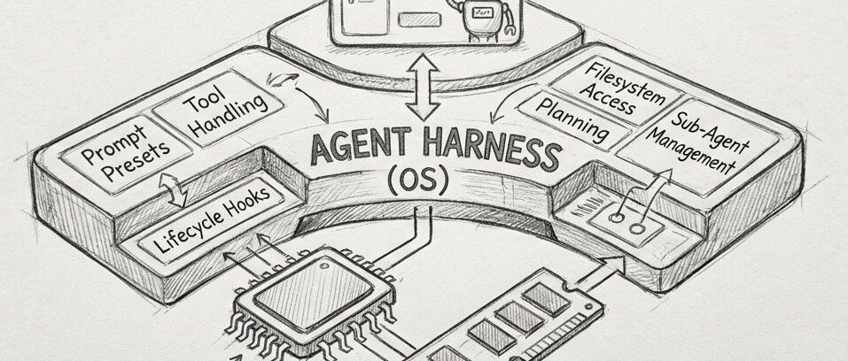
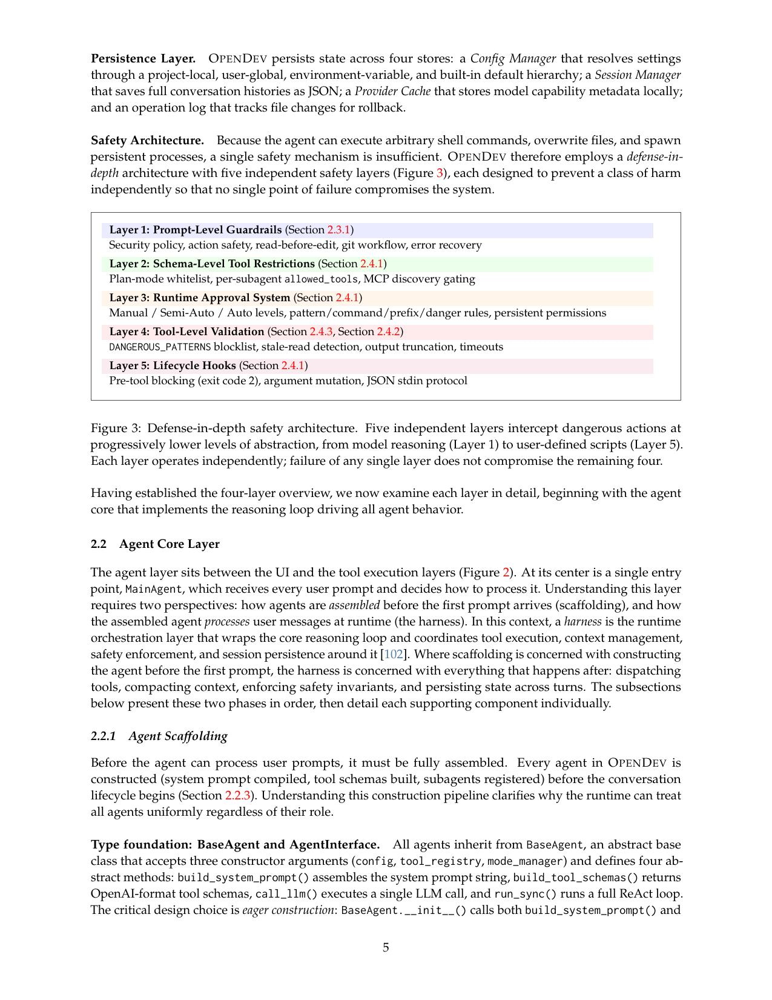
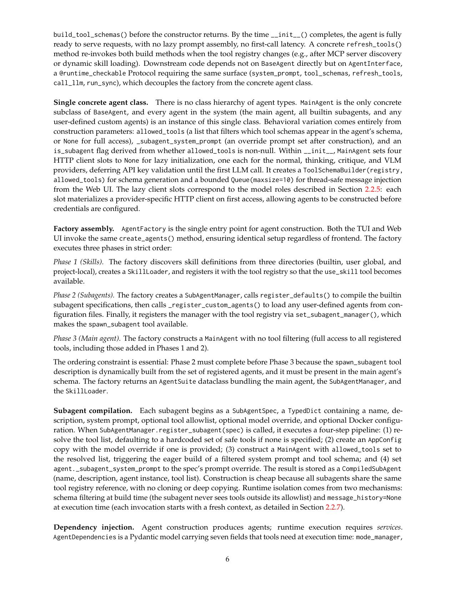
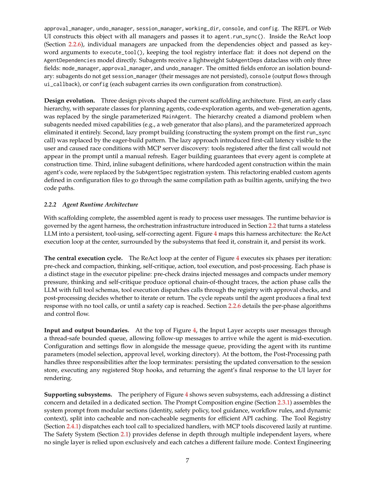
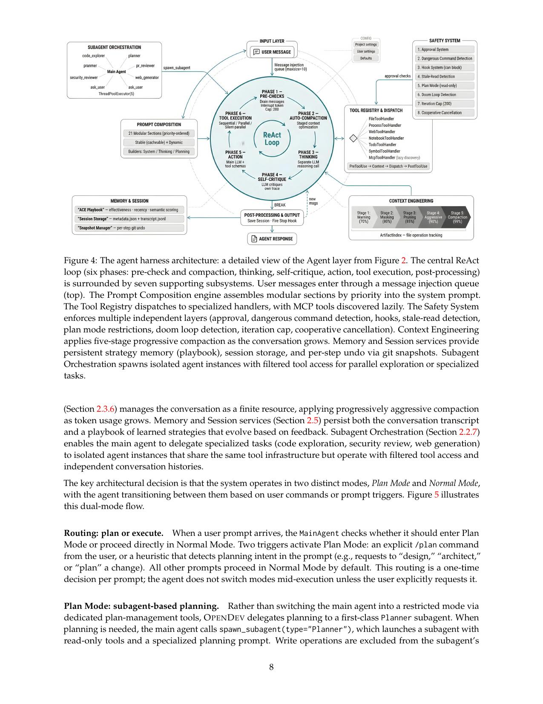
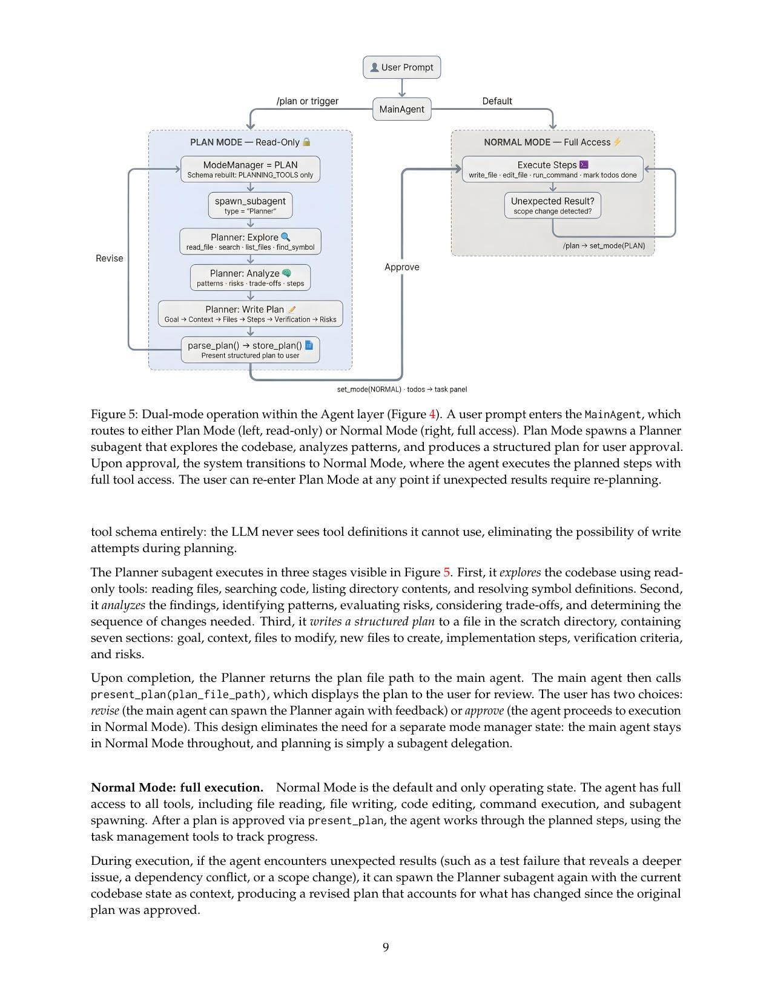
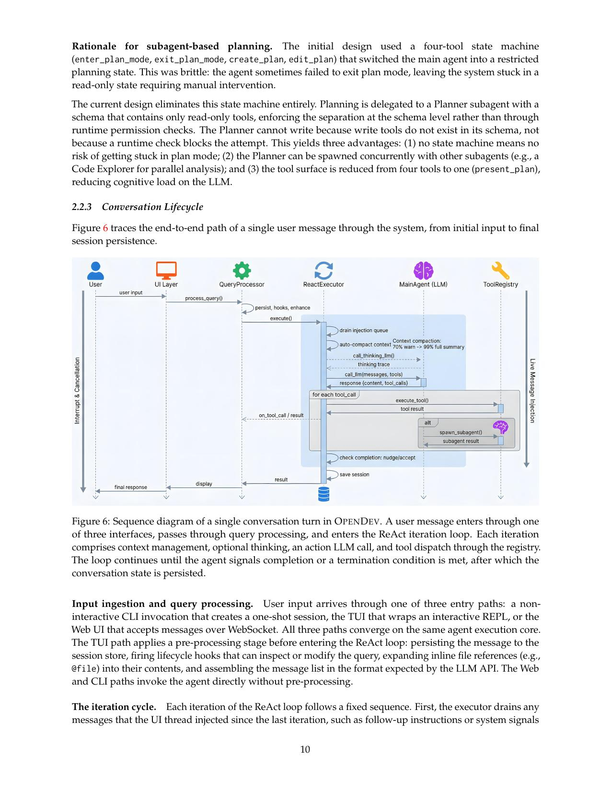
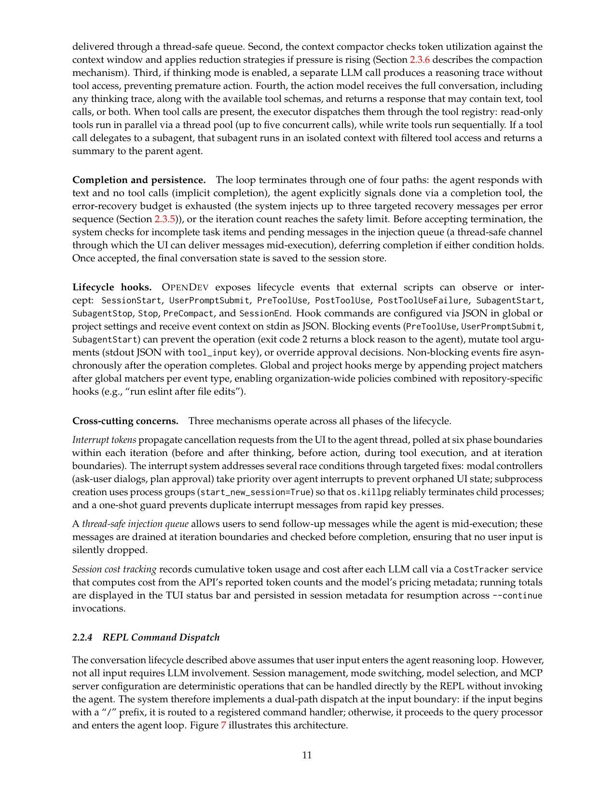

# 高效Agents的尽头是，Harness

> 作者：PaperAgent | 来源：PaperToday | 发布日期：2026年3月24日 16:08

---

大家好，我是PaperAgent，不是Agent！

玩过 **Agent** 的人都有这种体验：前五轮，它像个天才；十五轮后，开始犯蠢；二十轮后，它连自己最开始要干嘛都忘了。

很多人把 **Agent** 当成一个"**模型+工具**"的简单组合。但**跑长了**就知道，这**远远不够**。

philschmid打了个比方：模型是CPU，上下文是内存，而 **Harness** 是操作系统。没有 **操作系统**，再强的CPU也撑不起复杂任务。

目前，通用型 **Harness** 还很罕见。**OpenDev** 是这一新兴类别的典型代表，他们把Agent跑长跑会遇到的坑，一个一个填平了。

AI编程助手正在经历一场根本性转变。从Copilot的代码补全，到Claude Code、Aider等终端原生Agent，开发者们发现：**真正的自动化需要直接运行在开发者管理源码、执行构建、部署环境的地方——终端**。

但构建一个**生产级的终端Agent**绝非易事。长周期会话中的上下文窗口爆炸、破坏性命令的安全风险、以及多步骤任务的推理退化，这些都是IDE插件时代不必面对的挑战。

---

## 1 核心理念：Scaffolding + Harness

传统Agent往往混淆了两个不同的阶段：

- **Scaffolding（脚手架）**：在第一个Prompt到达之前完成的工作——组装System Prompt、构建Tool Schema、注册Subagent。这部分应该**eager construction（即时构建）**，确保Agent在运行时已是完全就绪状态。

- **Harness（马具/运行时框架）**：第一个Prompt之后的所有工作——工具调度、上下文管理、安全强制执行、会话持久化。这是Agent的**运行时编排层**。

**关键洞察**：将构建期与运行时分离开，意味着你可以独立演化每个部分。新增工具只需修改Registry，而变更压缩策略只需调整Harness。

---

## 2 Extended ReAct：不只是"思考-行动"

**Agent Harness架构**实现了一个扩展的ReAct循环，包含六个阶段：

1. **Pre-check & Compaction**：检查注入队列，执行上下文压缩
2. **Thinking**：独立的思考阶段（无工具访问），防止过早行动
3. **Self-Critique**：自批判阶段（仅在HIGH级别启用）
4. **Action**：主LLM调用，产生工具调用
5. **Tool Execution**：并行/串行执行工具
6. **Post-processing**：学习记录、会话保存

特别值得注意的是**Phase 0的Staged Context Management**。系统监控Token使用率，在70%、80%、85%、90%、99%五个阈值采取不同策略。

---

## 3 Context Engineering：上下文是一等公民

在长周期终端会话中，**上下文管理不是优化项，而是基础性工程问题**。OpenDev提出了Context Engineering Layer，包含四个关键子系统：

### 3.1 动态System Prompt组装

通过Priority-ordered conditional composition，根据运行时环境动态加载Prompt片段。例如，只有在Git仓库中才加载Git工作流指南，只有启用Todo跟踪时才加载任务管理指令。

### 3.2 自适应上下文压缩（ACC）

不同于简单的"到达阈值就总结"，ACC采用渐进式策略：
- **Active State**：最近的消息，完整保留
- **Faded State**：较旧的消息，替换为引用指针
- **Archived State**：归档到磁盘，完全移出上下文

### 3.3 系统提醒（System Reminders）

解决"指令衰减"问题：随着会话变长，模型对初始System Prompt的关注度下降。OPENDEV通过**事件驱动的即时提醒**在关键时刻注入短小的user-role消息：
- 检测到未完成Todo却调用task_complete时
- 连续5次只读操作后（防止探索螺旋）
- 工具调用失败后

### 3.4 双记忆架构（Dual-Memory）

为Thinking模型设计的特殊架构：
- **Episodic Memory**：LLM生成的长程对话摘要（每5条消息更新一次）
- **Working Memory**：最近6条消息的原文

这既避免了长上下文超限，又保留了关键细节。

---

## 4 防御纵深：五层安全架构

终端Agent能执行任意Shell命令，这带来了巨大风险。OPENDEV采用**五层独立的安全机制**：

1. **Prompt-Level Guardrails**：System Prompt中的安全策略
2. **Schema-Level Tool Restrictions**：通过Tool Schema过滤（如Planner Subagent只能看到只读工具）
3. **Runtime Approval System**：Manual/Semi-Auto/Auto三级审批
4. **Tool-Level Validation**：危险模式检测（rm -rf /等）、陈旧读取检测
5. **Lifecycle Hooks**：用户自定义的Pre/Post工具钩子

**关键设计**：让危险工具"不可见"而非"被阻止"。当Tool Schema中根本不包含写工具时，LLM甚至不会尝试生成写操作，这比运行时权限检查更robust。

---

## 5 复合AI系统：多模型路由

OPENDEV采用Compound AI System架构，将不同工作负载路由到不同模型：

| Model Role | Purpose | Fallback Chain |
|------------|---------|----------------|
| **Action** | 主要执行模型 | - |
| **Thinking** | 深度推理（无工具） | Action |
| **Critique** | 自评估 | Thinking → Action |
| **Vision** | 图像处理 | Action (if capable) |
| **Compact** | 快速总结 | Action |

这种设计实现了**模型无关性**：切换提供商只需改配置，无需改代码。

---

## 6 工具系统：延迟发现与高效扩展

### 6.1 MCP（Model Context Protocol）延迟发现

为避免100个外部工具消耗20,000 Token的上下文，OPENDEV采用**Lazy Discovery**：只有在Agent调用`search_tools`或直接调用某个MCP工具时，该工具的Schema才被加载到上下文中。

### 6.2 9-Pass模糊匹配编辑

LLM生成的代码编辑往往有微小偏差（空格、缩进、转义序列）。`edit_file`工具实现了9级渐进式匹配链，从精确匹配到上下文感知匹配，大幅降低了"内容未找到"的错误率。

---

## 7 关键经验：五个设计权衡

OpenDev总结了五个跨领域的设计张力：

1. **灵活性 vs 稳定性**：过度抽象会牺牲可预测性
2. **压缩 vs 信息保留**：激进压缩可能丢失关键上下文
3. **安全 vs 生产力**：层层防护会降低效率
4. **多模型 vs 单一模型**：路由增加复杂度但提升质量
5. **延迟加载 vs 预加载**：惰性发现降低Token但增加延迟

---

## 8 最后，Harness作为新的抽象层

OpenDev的贡献不仅是又一个开源Coding Agent，而是提出了**Harness**这一关键抽象——将Agent的运行时编排从业务逻辑中分离出来。

在终端原生Agent的时代，我们需要的不是更聪明的Prompt，而是更健壮的**Scaffolding + Harness**架构：

- **Scaffolding** 确保Agent以正确的能力组合启动
- **Harness** 确保Agent在长周期、高风险的终端环境中安全、高效、持续地运行

正如论文所言："The design space for terminal-native agentic tools remains largely underexplored." 而 **Harness**，或许就是这个设计空间中最关键的 missing piece。

---

### 参考资料：
- [OpenDev论文：Building Effective AI Coding Agents for the Terminal](https://arxiv.org/pdf/2603.05344v3)
- [OpenDev GitHub](https://github.com/opendev-to/opendev)
- [Harness Engineering - OpenAI](https://openai.com/index/harness-engineering/)

---

*来源：PaperToday，专注大模型Graph/RAG/Agentic前沿技术与企业落地！*
